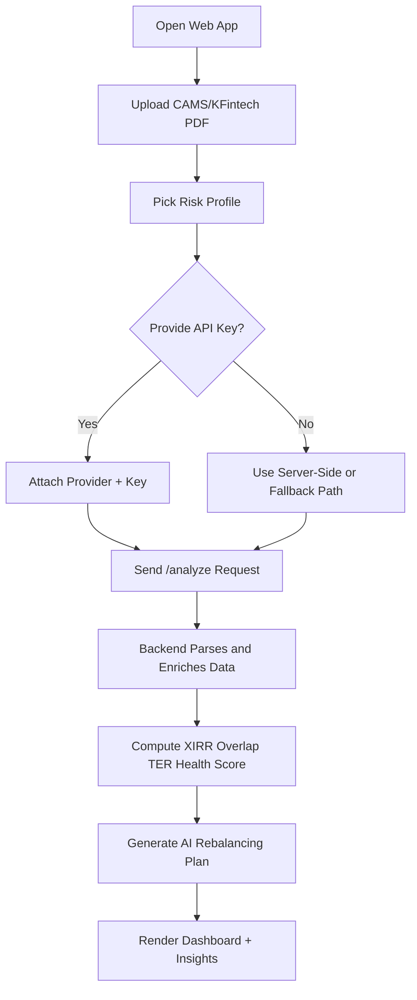
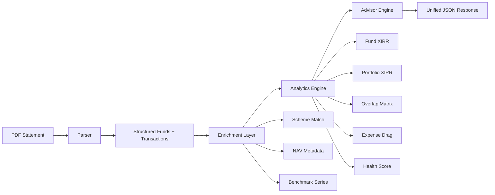

# MF Portfolio X-Ray

MF Portfolio X-Ray is a full-stack portfolio intelligence system for Indian mutual fund investors. It accepts CAMS/KFintech consolidated statement PDFs, reconstructs fund-level holdings, computes true money-weighted returns, evaluates overlap and fee drag, benchmarks against Nifty 50, and produces structured AI rebalancing guidance.

This repository root is submission-ready and intentionally includes both high-level context and practical run instructions for judges, reviewers, and collaborators.

## Submission Context

- Hackathon: ET AI Hackathon 2026
- Problem Statement: PS 9 - AI Money Mentor
- Primary project folder: [mf-portfolio-xray](mf-portfolio-xray)
- Detailed in-project documentation: [mf-portfolio-xray/README.md](mf-portfolio-xray/README.md)

## Why This Exists

Most retail investors cannot quickly answer:

1. What is my true return across staggered SIP cashflows?
2. Are my funds genuinely diversified or heavily overlapping?
3. How much return am I losing every year to TER drag?
4. Did I outperform Nifty over the same investment timeline?

MF Portfolio X-Ray solves this in one workflow using deterministic analytics plus optional AI recommendations.

## Core Capabilities

1. Portfolio Reconstruction: fund name, units, NAV, current value
2. Fund XIRR and Portfolio XIRR: cashflow-accurate, date-aware return analysis
3. Overlap Analysis: pairwise Jaccard similarity on holdings sets
4. Expense Drag: annual TER cost in INR and portfolio percentage impact
5. Benchmark Comparison: Nifty 50 simulation over matching investment dates
6. AI Advisor Layer: issue detection, rebalancing steps, tax notes
7. Health Score: unified 0-100 portfolio quality score

## System Architecture

Frontend

1. React + Vite + Tailwind + Recharts
2. Landing page plus analyzer dashboard
3. Optional user-provided API key input (Gemini or Anthropic)

Backend

1. FastAPI orchestrator
2. Parser module for CAMS/KFintech PDF extraction
3. Enrichment module for MFAPI and benchmark data
4. Analytics module for XIRR, overlap, expense drag, health scoring
5. Advisor module for LLM output generation (Gemini/Anthropic)

## Flowcharts

### End-to-End User Journey



### Backend Processing Pipeline



### Resilience and Fallback Logic

```mermaid
flowchart TD
	A[/analyze Request] --> B[Parse PDF]
	B --> C{Parse Success?}
	C -->|No| Z[Return HTTP 400 with reason]
	C -->|Yes| D[Enrich External Data]
	D --> E{Provider Errors?}
	E -->|Yes| F[Retry with Backoff]
	F --> G{Still Failing?}
	G -->|Yes| H[Return Partial Results + issues[]]
	G -->|No| I[Continue]
	E -->|No| I
	I --> J[Compute Metrics]
	J --> K[Generate AI Plan]
	K --> L{AI Available?}
	L -->|No| M[Set rebalancing_plan = null + issue]
	L -->|Yes| N[Attach Plan]
	M --> O[Return Stable Response]
	N --> O
```

Flow

1. Upload PDF
2. Parse statement into transactions and balances
3. Enrich with scheme metadata and benchmark history
4. Compute metrics and score
5. Generate advisory JSON
6. Render interactive dashboard

## Tech Stack

- Frontend: React 18, Vite, Tailwind CSS, Recharts
- Backend: Python, FastAPI, pdfplumber, scipy, rapidfuzz, httpx, yfinance
- AI Providers: Gemini, Anthropic

## Project Layout

```text
mfportfolio/
├── README.md
├── photos/
└── mf-portfolio-xray/
	├── backend/
	├── frontend/
	├── docs/
	│   └── screenshots/
	└── README.md
```

## Quick Start

Backend

```bash
cd mf-portfolio-xray/backend
python -m venv .venv
.venv\Scripts\activate
pip install -r requirements.txt
copy .env.example .env
uvicorn main:app --reload --port 8000
```

Frontend

```bash
cd mf-portfolio-xray/frontend
npm install
npm run dev
```

Frontend URL: http://localhost:5173

## Environment Variables

Create a local env file from [mf-portfolio-xray/backend/.env.example](mf-portfolio-xray/backend/.env.example).

Optional server-side keys:

1. GEMINI_API_KEY
2. ANTHROPIC_API_KEY

Runtime option:

1. Users can provide their own key in the app UI per analysis request.

## API Surface

Health

- GET /health

Analyze

- POST /analyze
- multipart fields:
1. file (PDF)
2. risk_profile (Conservative, Moderate, Aggressive)
3. user_api_provider (optional: gemini or anthropic)
4. user_api_key (optional)

## Reliability and Error Handling

1. Parser fallback logic for statement text variability
2. Retry with backoff and in-memory caching for enrichment calls
3. Graceful degradation on missing holdings and benchmark data
4. Partial analytics return even if AI advisory fails
5. XIRR edge cases return null safely without endpoint failure

## Validation Performed

1. Parser validation using realistic mock consolidated statement
2. Analytics validation for known XIRR case and edge conditions
3. Frontend production builds passing
4. End-to-end analyze request verified with optional user-provided key path

## Screenshots

Dashboard - Health and Fund Breakdown


Advisor Layer


Expense Drag Panel


## Security Notes

1. Do not commit real keys.
2. Use .env locally and keep only .env.example in source control.
3. Rotate keys immediately if exposed.

## Disclaimer

This tool provides informational analytics and AI-generated suggestions. It is not a substitute for regulated financial advice.
