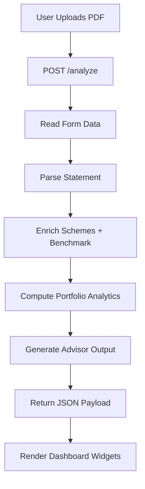
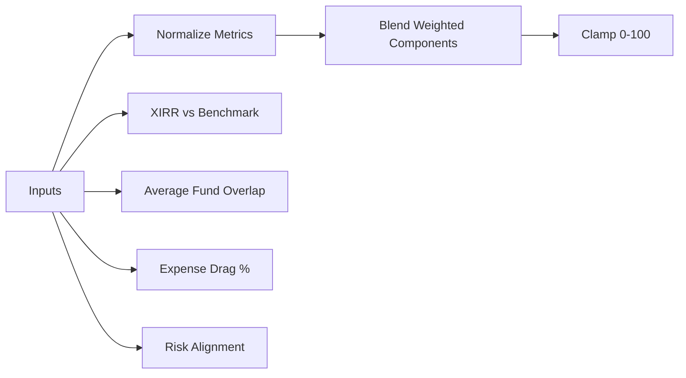
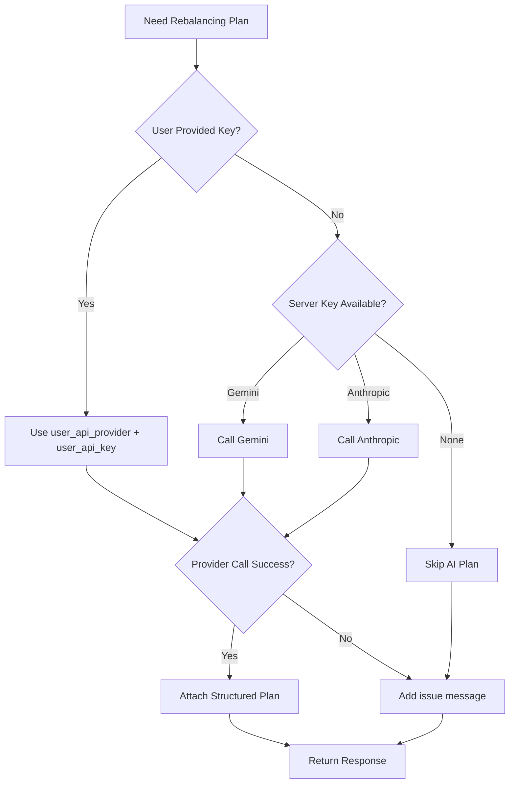

# MF Portfolio X-Ray

MF Portfolio X-Ray turns a CAMS/KFintech mutual fund statement into a complete portfolio intelligence report in one flow.

Instead of showing only generic returns, it reconstructs actual holdings, computes true money-weighted performance, quantifies hidden overlap and fee drag, benchmarks outcomes against Nifty 50 over the same investment dates, and generates actionable rebalancing guidance.

## Why This Matters

Most retail investors cannot quickly answer:

1. What is my real portfolio return after staggered SIP cashflows?
2. Are my funds diversified or quietly holding similar stocks?
3. How much am I losing every year to expense ratio drag?
4. Did my allocation beat the benchmark over the same period?

MF Portfolio X-Ray answers all four with a single upload.

## What The App Delivers

1. Portfolio reconstruction: fund-wise units, NAV, value, and allocation weight
2. Fund-level XIRR and portfolio-level XIRR
3. Overlap matrix between funds (Jaccard similarity)
4. Annual TER drag in INR and percentage terms
5. Benchmark XIRR simulation (Nifty 50, same contribution timeline)
6. AI advisor output:
   - plain-English summary
   - prioritized issues
   - concrete rebalancing steps
   - tax notes
7. Portfolio Health Score (0-100)

## Product Experience

1. Landing view with a direct Get Started path (no login wall)
2. Upload CAMS/KFintech consolidated PDF
3. Select risk profile: Conservative, Moderate, or Aggressive
4. Optional: provide your own Gemini/Anthropic API key in UI
5. Analyze and review the full dashboard

## Screenshots

### Dashboard: Health + Portfolio Reconstruction


### Advisor Layer


### Expense Drag Panel


## Technical Architecture

### Frontend

- React 18 + Vite
- Tailwind CSS
- Recharts
- Lazy-loaded heavy dashboard modules for better initial load

### Backend

- FastAPI (single orchestration layer)
- pdfplumber for statement extraction
- scipy for XIRR root solving
- rapidfuzz for scheme name matching
- httpx for external API calls
- yfinance for benchmark data

### AI Providers

- Gemini
- Anthropic (fallback/alternate)
- Supports runtime user-provided key via form fields

## Backend Pipeline

1. Parse PDF statement into structured transactions
2. Enrich funds using scheme search + NAV/fund metadata
3. Build cashflows and compute XIRR (fund + portfolio)
4. Simulate benchmark XIRR on matching dates
5. Compute overlap and TER drag
6. Compute health score
7. Generate AI recommendation JSON
8. Return one unified response to frontend

## Flowcharts

### Analysis Request Lifecycle



### Health Score Composition



### AI Provider Selection Path



## Reliability Engineering

The app is designed to degrade gracefully, not fail abruptly.

1. Parser fallback logic for layout variation in statement text
2. Retry with exponential backoff for enrichment APIs
3. In-memory caching for repeated scheme/NAV lookups
4. Partial results returned even when one data provider is unavailable
5. XIRR edge cases return null safely instead of crashing
6. Clear issue messages surfaced to the user

## API Contract

### GET /health

Health check endpoint.

### POST /analyze

Accepts `multipart/form-data`:

1. `file` (required): PDF statement
2. `risk_profile` (optional): Conservative, Moderate, Aggressive
3. `user_api_provider` (optional): gemini or anthropic
4. `user_api_key` (optional): provider key for per-request AI

Returns a full JSON payload containing:

1. health score
2. invested/current value
3. overall and benchmark XIRR
4. fund-level metrics
5. overlap pairs
6. TER drag
7. AI rebalancing plan
8. issues/warnings

## Local Setup

### Backend

```bash
cd backend
python -m venv .venv
.venv\Scripts\activate
pip install -r requirements.txt
copy .env.example .env
uvicorn main:app --reload --port 8000
```

### Frontend

```bash
cd frontend
npm install
npm run dev
```

Open:

1. Frontend: http://localhost:5173
2. Health check: http://localhost:5173/api/health

## Environment Variables

Create `backend/.env` from `backend/.env.example`.

Optional server-side keys:

1. `GEMINI_API_KEY`
2. `ANTHROPIC_API_KEY`

If not set, users can still provide a key directly in the UI at runtime.

## Security Notes

1. Never commit real API keys
2. Keep secrets in `.env` only
3. Commit `.env.example` for placeholders
4. Rotate keys immediately if exposed

## Limitations and Next Improvements

1. Holdings source quality can vary across schemes
2. NAV/category metadata depends on external provider availability
3. Future scope:
   - richer historical trend views
   - tax-optimized switch simulation
   - category drift alerts and allocation guardrails

## Disclaimer

This application provides analytical insights and AI-generated suggestions. It is not a substitute for regulated financial advice.
