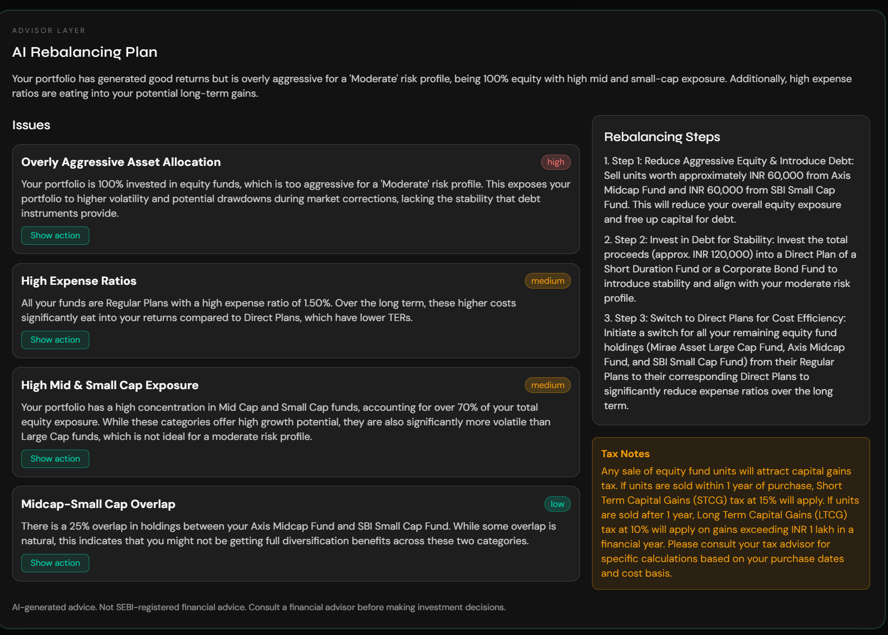
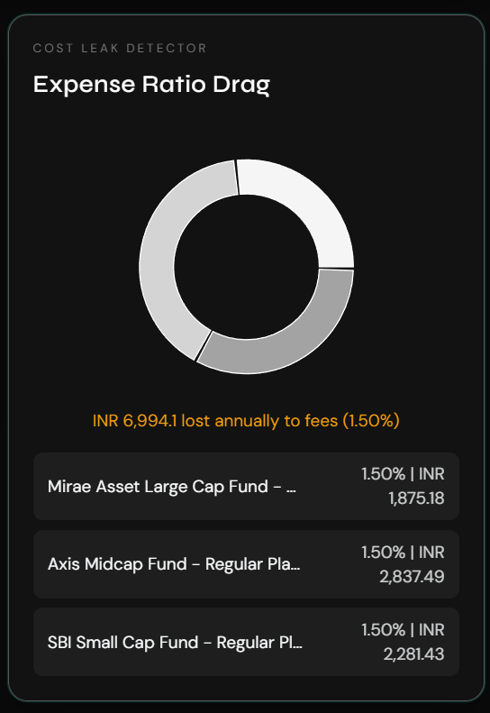
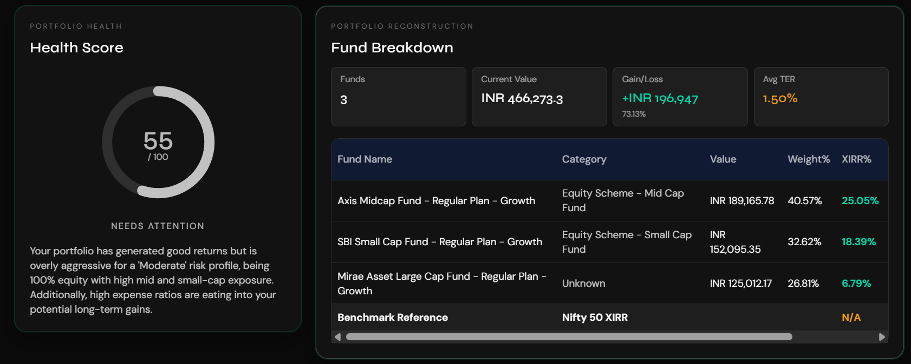

# MF Portfolio X-Ray

MF Portfolio X-Ray is a full-stack web application for analyzing Indian mutual fund portfolios from CAMS/KFintech consolidated account statements. Upload a statement PDF and the app reconstructs holdings, computes true XIRR, measures overlap risk, estimates annual TER drag, compares against Nifty 50, and generates AI-backed rebalancing guidance.

This project is built for ET AI Hackathon 2026 (PS 9: AI Money Mentor) and is designed to be resilient: parsing has fallback logic, enrichment calls retry with caching, and analysis returns partial results instead of failing hard when external providers are unavailable.

## Features

- Real PDF-based portfolio reconstruction (funds, units, values)
- Fund-level and portfolio-level true XIRR
- Fund overlap matrix (Jaccard similarity)
- Expense ratio drag in INR and percentage
- Nifty 50 benchmark comparison across matching investment period
- AI rebalancing advisor with optional user-provided API key
- Portfolio health score (0-100)

## Screenshots

### Dashboard - Health and Portfolio Reconstruction


### Advisor Layer


### Expense Drag Panel


## Tech Stack

- Frontend: React 18, Vite, Tailwind CSS, Recharts
- Backend: FastAPI, pdfplumber, scipy, rapidfuzz, httpx, yfinance
- AI Providers: Gemini, Anthropic

## Project Structure

```text
mf-portfolio-xray/
├── backend/
│   ├── main.py
│   ├── parser.py
│   ├── analytics.py
│   ├── enrichment.py
│   ├── advisor.py
│   ├── models.py
│   ├── test_parser.py
│   ├── test_analytics.py
│   ├── requirements.txt
│   └── .env.example
├── frontend/
│   ├── src/
│   │   ├── App.jsx
│   │   ├── main.jsx
│   │   └── components/
│   ├── package.json
│   └── vite.config.js
├── docs/
│   └── screenshots/
└── README.md
```

## Setup

### 1) Backend

```bash
cd backend
python -m venv .venv
# Windows
.venv\Scripts\activate
# macOS/Linux
# source .venv/bin/activate
pip install -r requirements.txt
copy .env.example .env
uvicorn main:app --reload --port 8000
```

### 2) Frontend

```bash
cd frontend
npm install
npm run dev
```

Frontend runs at `http://localhost:5173`.

## Environment Variables

Create `backend/.env` from `backend/.env.example`.

- `GEMINI_API_KEY=your_key_here`
- `ANTHROPIC_API_KEY=your_key_here`

Notes:
- You can keep backend keys empty and provide an API key at runtime from the app UI.
- Do not commit real API keys.

## API Endpoints

- `GET /health` - health check
- `POST /analyze` - analyze uploaded statement PDF

`POST /analyze` accepts multipart form fields:
- `file` (PDF)
- `risk_profile` (`Conservative`, `Moderate`, `Aggressive`)
- `user_api_provider` (optional: `gemini` or `anthropic`)
- `user_api_key` (optional)

## Error Handling and Resilience

- Parser failures return HTTP 400 with CAMS/KFintech guidance
- Enrichment calls use retries and fallback values
- Missing holdings gracefully degrades overlap section
- AI failures return computed analytics with advisory issue notes
- XIRR edge cases return `null` instead of breaking the response

## Local Validation

Run parser and analytics tests:

```bash
cd backend
python test_parser.py
python test_analytics.py
```

## Security

- `.env` is ignored through `.gitignore`
- Only `.env.example` should be committed
- Rotate keys immediately if exposed publicly

## Disclaimer

AI-generated recommendations are informational only and are not a substitute for regulated financial advice.
